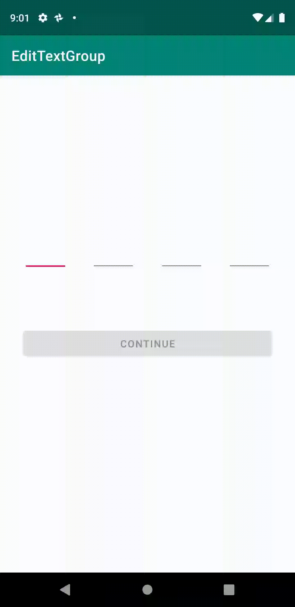

# SpacedEditTexts
A simple android library for collecting PINs or similar info.

## How it works
The library links any number of edittexts together as one long edittext (as shown below), leaving you free to style your input as desired, while the library handles the text collection.



## Before you begin
**Step 1.** Add it in your root build.gradle at the end of repositories:

    allprojects {
		repositories {
			...
			maven { url 'https://jitpack.io' }
		}
	}

**Step 2.** Add the dependency

    dependencies {
	     implementation 'com.github.jeremiahAI:SpacedEditTexts:1.0.3'
	}
  
  ## Usage
  **Step 1.** Design your layout of edittexts the size of your input, e.g. four EditTexts for a four-digit pin.
  
  **Step 2.** Register your editTexts with the library by passing them to the `registerEditTexts()` function.
  
  ```java
    registerEditTexts(
            editText1,
            editText2,
            editText3,
            editText4
        )
  ```
  > :warning: Ensure to add the EditTexts in their order on the screen.
  
  **Step 3.** Collect the text by calling the `collectTextFromEditTexts()` passing them to the `registerEditTexts()` function.
  
  ```java
    result = registerEditTexts()
  ```
## License

```
Rave's Android SDK
MIT License

Copyright (c) 2020

Permission is hereby granted, free of charge, to any person obtaining a copy
of this software and associated documentation files (the "Software"), to deal
in the Software without restriction, including without limitation the rights
to use, copy, modify, merge, publish, distribute, sublicense, and/or sell
copies of the Software, and to permit persons to whom the Software is
furnished to do so, subject to the following conditions:

The above copyright notice and this permission notice shall be included in all
copies or substantial portions of the Software.

THE SOFTWARE IS PROVIDED "AS IS", WITHOUT WARRANTY OF ANY KIND, EXPRESS OR
IMPLIED, INCLUDING BUT NOT LIMITED TO THE WARRANTIES OF MERCHANTABILITY,
FITNESS FOR A PARTICULAR PURPOSE AND NONINFRINGEMENT. IN NO EVENT SHALL THE
AUTHORS OR COPYRIGHT HOLDERS BE LIABLE FOR ANY CLAIM, DAMAGES OR OTHER
LIABILITY, WHETHER IN AN ACTION OF CONTRACT, TORT OR OTHERWISE, ARISING FROM,
OUT OF OR IN CONNECTION WITH THE SOFTWARE OR THE USE OR OTHER DEALINGS IN THE
SOFTWARE.
```
  
  
